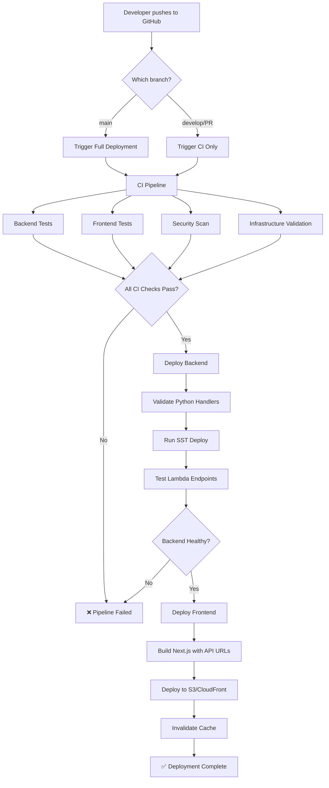

# CI/CD Pipeline Architecture

## Complete Pipeline Flow



## Detailed Workflow Stages

### Stage 1: Continuous Integration (CI)

```
┌──────────────────────────────────────────────────────┐
│                   CI Pipeline                         │
├──────────────────────────────────────────────────────┤
│                                                       │
│  ┌─────────────┐  ┌──────────────┐  ┌─────────────┐ │
│  │   Backend   │  │   Frontend   │  │  Security   │ │
│  │    Tests    │  │    Tests     │  │    Scan     │ │
│  └──────┬──────┘  └──────┬───────┘  └──────┬──────┘ │
│         │                │                  │         │
│         │                │                  │         │
│  ┌──────▼────────────────▼──────────────────▼──────┐ │
│  │         Infrastructure Validation               │ │
│  └──────────────────────────────────────────────────┘ │
│                                                       │
└──────────────────────────────────────────────────────┘
```

**Python Backend:**
- Syntax validation (`py_compile`)
- Code linting (`pylint`)
- Unit tests (when available)

**TypeScript Frontend:**
- ESLint checks
- TypeScript type checking
- Build verification
- Bundle size analysis

**Security:**
- Trivy vulnerability scanning
- Dependency audit
- SARIF report generation

### Stage 2: Backend Deployment

```
┌──────────────────────────────────────────────────────┐
│               Backend Deployment                      │
├──────────────────────────────────────────────────────┤
│                                                       │
│  ┌─────────────────────────────────────────────────┐ │
│  │  1. Setup Environment (Node.js + Python)        │ │
│  └────────────────────┬────────────────────────────┘ │
│                       │                               │
│  ┌────────────────────▼───────────────────────────┐  │
│  │  2. Validate Lambda Handlers                   │  │
│  │     • counter_handler.py                       │  │
│  │     • chatbot_handler.py                       │  │
│  └────────────────────┬────────────────────────────┘ │
│                       │                               │
│  ┌────────────────────▼───────────────────────────┐  │
│  │  3. Deploy with SST                            │  │
│  │     • Lambda Functions                         │  │
│  │     • DynamoDB Table                           │  │
│  │     • IAM Roles                                │  │
│  │     • CloudWatch Logs                          │  │
│  └────────────────────┬────────────────────────────┘ │
│                       │                               │
│  ┌────────────────────▼───────────────────────────┐  │
│  │  4. Test Endpoints                             │  │
│  │     • curl counter API                         │  │
│  │     • curl chatbot API                         │  │
│  │     • Validate responses                       │  │
│  └────────────────────┬────────────────────────────┘ │
│                       │                               │
│  ┌────────────────────▼───────────────────────────┐  │
│  │  5. Output URLs for Frontend                   │  │
│  └────────────────────────────────────────────────┘  │
│                                                       │
└──────────────────────────────────────────────────────┘
```

**AWS Resources Created:**
- 2x Lambda Functions (Python 3.12)
- 1x DynamoDB Table
- 2x Lambda Function URLs
- IAM Roles & Policies
- CloudWatch Log Groups

### Stage 3: Frontend Deployment

```
┌──────────────────────────────────────────────────────┐
│              Frontend Deployment                      │
├──────────────────────────────────────────────────────┤
│                                                       │
│  ┌─────────────────────────────────────────────────┐ │
│  │  1. Receive API URLs from Backend Stage        │ │
│  └────────────────────┬────────────────────────────┘ │
│                       │                               │
│  ┌────────────────────▼───────────────────────────┐  │
│  │  2. Install Dependencies (npm ci)              │  │
│  └────────────────────┬────────────────────────────┘ │
│                       │                               │
│  ┌────────────────────▼───────────────────────────┐  │
│  │  3. Build Next.js with Environment Variables   │  │
│  │     NEXT_PUBLIC_COUNTER_API=<counter-url>      │  │
│  │     NEXT_PUBLIC_CHATBOT_API=<chatbot-url>      │  │
│  └────────────────────┬────────────────────────────┘ │
│                       │                               │
│  ┌────────────────────▼───────────────────────────┐  │
│  │  4. Deploy to S3 Bucket                        │  │
│  │     aws s3 sync out/ s3://bucket/              │  │
│  └────────────────────┬────────────────────────────┘ │
│                       │                               │
│  ┌────────────────────▼───────────────────────────┐  │
│  │  5. Invalidate CloudFront Cache (Optional)     │  │
│  │     aws cloudfront create-invalidation         │  │
│  └────────────────────────────────────────────────┘  │
│                                                       │
└──────────────────────────────────────────────────────┘
```

## Deployment Triggers

### Automatic Triggers

| Workflow | Trigger | Condition |
|----------|---------|-----------|
| **CI** | `push`, `pull_request` | Any branch (main, develop) |
| **Backend Deploy** | `push` | Changes to `*_handler.py`, `sst.config.ts`, `pyproject.toml` |
| **Full Deploy** | `push` | Push to `main` branch |

### Manual Triggers

All workflows support `workflow_dispatch` for manual execution:

```yaml
workflow_dispatch:
  inputs:
    environment:
      type: choice
      options: [production, staging]
```

## Security & Authentication

### OIDC Authentication Flow

```
┌─────────────────┐
│ GitHub Actions  │
│                 │
│  1. Request     │
│     token       │
└────────┬────────┘
         │
         ▼
┌─────────────────┐
│ GitHub OIDC     │
│ Provider        │
│                 │
│  2. Generate    │
│     JWT token   │
└────────┬────────┘
         │
         ▼
┌─────────────────┐
│ AWS STS         │
│                 │
│  3. Assume      │
│     IAM Role    │
└────────┬────────┘
         │
         ▼
┌─────────────────┐
│ Temporary AWS   │
│ Credentials     │
│                 │
│  4. Deploy      │
│     resources   │
└─────────────────┘
```

**Benefits:**
- ✅ No long-lived credentials
- ✅ Automatic credential rotation
- ✅ Fine-grained permissions
- ✅ Audit trail in CloudTrail

## Monitoring & Observability

### GitHub Actions Dashboard

```
Repository → Actions
    │
    ├── Workflows
    │   ├── CI ✅
    │   ├── Deploy Backend ✅
    │   └── Full Deploy ✅
    │
    ├── Runs (Last 90 days)
    │   ├── Status: Success/Failed/Cancelled
    │   ├── Duration
    │   └── Branch
    │
    └── Insights
        ├── Usage (compute minutes)
        └── Caching efficiency
```

### AWS Monitoring

```
CloudWatch
    │
    ├── Lambda Metrics
    │   ├── Invocations
    │   ├── Duration
    │   ├── Errors
    │   └── Throttles
    │
    ├── DynamoDB Metrics
    │   ├── Read/Write Capacity
    │   ├── Throttled Requests
    │   └── Item Count
    │
    └── Logs
        ├── Lambda Execution Logs
        └── API Gateway Logs
```

## Performance Benchmarks

| Stage | Average Duration | Success Rate |
|-------|-----------------|--------------|
| CI Pipeline | 3-5 minutes | 95%+ |
| Backend Deploy | 2-3 minutes | 98%+ |
| Frontend Build | 1-2 minutes | 99%+ |
| **Total Pipeline** | **6-10 minutes** | **95%+** |

## Failure Handling

### Automatic Rollback

```yaml
# Backend deployment uses SST's automatic rollback
# If Lambda fails health check, SST reverts to previous version
```

### Manual Rollback

```bash
# List previous deployments
npx sst outputs --stage production

# Redeploy previous version
git checkout <previous-commit>
npx sst deploy --stage production
```

### Notification on Failure

```yaml
- name: Notify on failure
  if: failure()
  run: |
    echo "Deployment failed!"
    # Send Slack/Email notification
```

---

**Pipeline Version**: 1.0
**Last Updated**: November 2025
**Maintained By**: Cloud Resume Challenge Team
